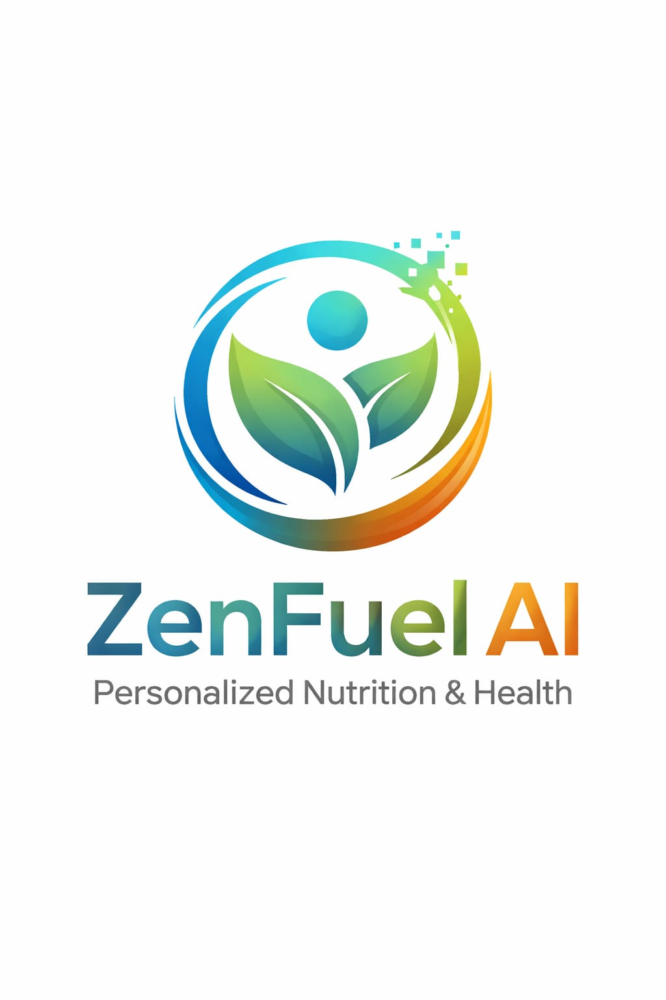

<p align="center">
  
</p>

<h1 align="center">ZenFuel AI</h1>

<p align="center">
  <strong>Know Your Body. Own Your Health.</strong><br/>
  AI-powered Health & Nutrition Advisor built with Flutter + Firebase + Machine Learning
</p>

<p align="center">
  
  
  
  
  
  
</p>

---

## Table of Contents

- [Overview](#overview)
- [Key Features](#key-features)
- [Tech Stack](#tech-stack)
- [Architecture](#architecture)
- [Project Structure](#project-structure)
- [Feature Modules](#feature-modules)
- [Data Models](#data-models)
- [Backend Services](#backend-services)
- [Firebase Collections](#firebase-collections)
- [ML & AI Pipeline](#ml--ai-pipeline)
- [Authentication Flow](#authentication-flow)
- [App Workflows](#app-workflows)
- [Assets & Data](#assets--data)
- [Design System](#design-system)
- [Getting Started](#getting-started)
- [Build & Deploy](#build--deploy)
- [Screenshots](#screenshots)
- [Contributing](#contributing)
- [License](#license)

---

## Overview

**ZenFuel AI** is a comprehensive, AI-powered health and nutrition mobile application that provides personalized meal plans, workout routines, health risk predictions, and real-time analytics — all calibrated to each user's body metrics, dietary preferences, and fitness goals.

The app combines **Firebase** for real-time cloud infrastructure, **Riverpod** for reactive state management, and a **Machine Learning backend** (hosted on Render) that runs Random Forest, Gradient Boosting, and Ridge Regression models to deliver personalized health insights.

### What Makes ZenFuel AI Different

| Aspect | Description |
|--------|-------------|
| **Personalized ML Predictions** | Health risk scores, BMI categorization, calorie targets — all computed from user data |
| **Dynamic Meal Engine** | 638+ meals with swap support, dietary filters, and real-time macro tracking |
| **Smart Workout Plans** | 175+ exercises across Beginner/Intermediate/Advanced with warm-up → main → cool-down structure |
| **Real-time Analytics** | Performance gauges, nutrition scores, and activity tracking that update instantly |
| **Device Integration** | Syncs with Android Health Connect for steps, heart rate, sleep, and calories burned |
| **Gamification** | Login streaks, badge tiers (Bronze → Platinum → Legend), and habit tracking |

---

## Key Features

### Nutrition & Meals
- AI-generated daily meal plans calibrated to calorie targets
- 638+ recipes with full nutritional data (calories, protein, carbs, fat, fiber)
- Meal swapping with smart alternatives
- Mark meals as eaten with instant analytics update
- Dietary filter support: Vegetarian, Vegan, Non-Vegetarian
- Cuisine diversity: Indian, Asian, Mediterranean, Continental, Mexican
- Allergen tracking and health score per meal (0–100)
- Daily / Weekly / Monthly nutrition analytics

### Fitness & Workouts
- Personalized workout plans by activity level and location (Home / Gym)
- 175+ exercises across 3 difficulty levels
- Structured sessions: Warm-up → Main Exercises → Cool-down
- Exercise-level completion tracking with sets/reps
- Monthly workout calendar with progress persistence
- Duration tracking (30–45+ minutes)

### Health Risk Predictions
- ML-based health risk assessment (Obesity, Diabetes, Hypertension)
- Risk scores (0–100) with Low / Moderate / High levels
- BMI categorization via Random Forest
- Badge status via Gradient Boosting
- Calorie target via Ridge Regression

### Performance Analytics
- Real-time performance gauges (Nutrition, Activity, Sleep, Hydration)
- Dynamic scores that update on meal toggle, swap, and workout completion
- 7-day and 30-day trend analysis
- PDF report generation with macro breakdowns
- Weight trend tracking

### Device Health Integration
- Android Health Connect / iOS HealthKit integration
- Real-time step counting via Pedometer
- Heart rate, sleep duration, calories burned sync
- Body weight tracking from connected devices

### Gamification & Habits
- Login streak counter with badge tiers:
  - **Bronze:** 7 days | **Silver:** 15 days | **Gold:** 30 days | **Platinum:** 90 days | **Legend:** 180 days
- Habit tracker with achievement milestones
- Daily goals: Water intake, Steps, Sleep hours

### Additional Features
- BMI calculator with health insights
- Grocery/shopping list from meal plans
- Push notifications via Firebase Cloud Messaging
- PDF export of health reports
- Onboarding walkthrough for new users

---

## Tech Stack

### Core Framework

| Layer | Technology | Version |
|-------|-----------|---------|
| **Frontend** | Flutter | 3.9.2 |
| **Language** | Dart | 3.9.2 |
| **State Management** | Riverpod | 2.5.1 |
| **Code Generation** | Riverpod Generator + build_runner | 2.4.0 / 2.4.8 |

### Backend & Cloud

| Service | Technology | Purpose |
|---------|-----------|---------|
| **Authentication** | Firebase Auth | Email/password auth, session management |
| **Database** | Cloud Firestore | Real-time document database |
| **Storage** | Firebase Storage | User profile photos, assets |
| **Messaging** | Firebase Cloud Messaging | Push notifications |
| **ML API** | Render.com | Hosted ML prediction service |

### ML Models

| Model | Algorithm | Purpose |
|-------|-----------|---------|
| **BMI Classifier** | Random Forest | Categorize BMI (Underweight / Normal / Overweight / Obese) |
| **Badge Predictor** | Gradient Boosting | Predict badge tier from user activity |
| **Calorie Target** | Ridge Regression | Calculate personalized daily calorie target |

### Key Dependencies

| Package | Version | Purpose |
|---------|---------|---------|
| `firebase_core` | ^3.6.0 | Firebase initialization |
| `firebase_auth` | ^5.3.1 | User authentication |
| `cloud_firestore` | ^5.4.3 | Cloud database |
| `firebase_storage` | ^12.3.2 | File storage |
| `firebase_messaging` | ^15.1.3 | Push notifications |
| `flutter_riverpod` | ^2.5.1 | Reactive state management |
| `dio` | ^5.7.0 | HTTP client for ML API |
| `health` | ^13.0.0 | Health data integration |
| `pedometer` | ^4.0.0 | Step counting |
| `fl_chart` | ^0.69.0 | Charts & data visualization |
| `lottie` | ^3.1.2 | Animations |
| `shimmer` | ^3.0.0 | Loading skeleton effects |
| `cached_network_image` | ^3.4.1 | Image caching |
| `google_fonts` | ^6.2.1 | Typography |
| `pdf` | ^3.11.1 | PDF report generation |
| `image_picker` | ^1.1.2 | Profile photo selection |
| `shared_preferences` | ^2.3.2 | Local key-value storage |
| `permission_handler` | ^11.3.1 | Runtime permissions |
| `intl` | ^0.19.0 | Date/number formatting |
| `uuid` | ^4.5.1 | Unique ID generation |

---

## Architecture

```
┌─────────────────────────────────────────────────────────┐
│                    Presentation Layer                     │
│  Screens ←→ Widgets ←→ Consumer/ConsumerStateful         │
├─────────────────────────────────────────────────────────┤
│                   State Management                       │
│  Riverpod Providers (AsyncNotifier, StateNotifier, etc.) │
├─────────────────────────────────────────────────────────┤
│                     Service Layer                        │
│  AuthService │ FirestoreService │ HealthService │ ApiSvc │
├─────────────────────────────────────────────────────────┤
│                     Data Layer                           │
│  Firebase (Auth, Firestore, Storage, FCM) │ ML API      │
│  Local Assets (JSON) │ SharedPreferences │ Health SDK    │
└─────────────────────────────────────────────────────────┘
```

### State Management Pattern

The app uses **Riverpod** with the following provider types:

- `AsyncNotifierProvider` — Complex async state with in-memory mutations (e.g., `performanceReportProvider`)
- `FutureProvider` — One-shot async data fetching (e.g., `predictionsFutureProvider`)
- `StreamProvider` — Real-time streams (e.g., `authStateProvider`)
- `StateNotifierProvider` — Synchronous state mutations (e.g., `exerciseCompletionProvider`)
- `Provider.family` — Parameterized providers (e.g., `mealPlanProvider(date)`)

---

## Project Structure

```
health_nutrition_app/
├── lib/
│   ├── main.dart                          # App entry point, Firebase init, provider scope
│   ├── firebase_options.dart              # Firebase configuration
│   │
│   ├── core/
│   │   ├── theme/
│   │   │   ├── app_colors.dart            # Color palette (Neon Green primary)
│   │   │   ├── app_typography.dart         # Typography system
│   │   │   └── app_theme.dart             # ThemeData & card decorations
│   │   ├── constants/
│   │   │   └── app_constants.dart          # Default goals, streak thresholds, timeouts
│   │   ├── icons/
│   │   │   └── lucide_fallback.dart        # Icon set
│   │   └── utils/
│   │       ├── formatters.dart            # Data formatting helpers
│   │       ├── validators.dart            # Input validation (email, password)
│   │       └── auth_error_messages.dart   # User-friendly error strings
│   │
│   ├── models/
│   │   ├── meal.dart                      # Meal model with macros, dietary info
│   │   ├── user_profile.dart              # User profile with BMI/BMR/TDEE
│   │   ├── user_preferences.dart          # Diet, allergies, goals, activity level
│   │   ├── workout.dart                   # WorkoutPlan + WorkoutExercise
│   │   ├── prediction_result.dart         # ML prediction results
│   │   ├── habit.dart                     # Habit tracking model
│   │   └── badge.dart                     # Badge achievement model
│   │
│   ├── services/
│   │   ├── auth_service.dart              # Firebase Auth wrapper
│   │   ├── firestore_service.dart         # Firestore CRUD operations
│   │   ├── api_service.dart               # ML API client (Render.com)
│   │   ├── health_service.dart            # Health Connect / HealthKit
│   │   ├── notification_service.dart      # FCM push notifications
│   │   └── workout_service.dart           # Workout plan management
│   │
│   └── features/
│       ├── auth/                          # Authentication & onboarding
│       │   ├── screens/
│       │   │   ├── logo_screen.dart       # Splash + routing
│       │   │   ├── login_screen.dart      # Email/password login
│       │   │   ├── signup_screen.dart     # New user registration
│       │   │   ├── onboarding_screen.dart # 3-slide walkthrough
│       │   │   └── splash_screen.dart     # Initialization splash
│       │   └── providers/
│       │       └── auth_provider.dart     # Auth state, profile, preferences
│       │
│       ├── home/                          # Main dashboard
│       │   ├── screens/
│       │   │   └── home_screen.dart       # 5-tab home (Home, Meals, Reports, Grocery, Profile)
│       │   ├── providers/
│       │   └── services/
│       │       ├── streak_service.dart    # Login streak tracking
│       │       ├── pedometer_service.dart # Step counting
│       │       └── goal_service.dart      # Daily goal management
│       │
│       ├── meals/                         # Nutrition & meal management
│       │   ├── screens/
│       │   │   ├── meal_plan_screen.dart  # Daily/Weekly/Monthly meal views
│       │   │   ├── meal_detail_screen.dart # Meal nutrition details
│       │   │   ├── recipe_screen.dart     # Recipe browser
│       │   │   └── recipe_detail_screen.dart # Recipe steps & ingredients
│       │   └── providers/
│       │       └── meal_provider.dart     # Meal plan + swap + isEaten merge
│       │
│       ├── workout/                       # Fitness & exercise
│       │   ├── screens/
│       │   │   └── workout_screen.dart    # Workout plan with exercise tracking
│       │   └── providers/
│       │       └── workout_provider.dart  # Workout plans, completion state
│       │
│       ├── reports/                       # Analytics & insights
│       │   ├── screens/
│       │   │   └── reports_screen.dart    # Performance gauges & charts
│       │   ├── providers/
│       │   │   └── reports_provider.dart  # Report data + real-time score updates
│       │   └── services/
│       │       └── report_service.dart    # PDF report generation
│       │
│       ├── health_risk/                   # ML health predictions
│       │   ├── screens/
│       │   │   └── health_risk_screen.dart # Risk display UI
│       │   └── providers/
│       │       └── predictions_provider.dart # ML prediction data
│       │
│       ├── profile/                       # User profile & settings
│       │   ├── screens/
│       │   │   ├── profile_screen.dart    # Profile display
│       │   │   ├── profile_setup_screen.dart # Initial setup
│       │   │   ├── steps_setup_screen.dart   # Goals configuration
│       │   │   └── device_screen.dart     # Health device sync
│       │   └── providers/
│       │
│       ├── streaks/                       # Gamification
│       │   ├── screens/
│       │   │   └── habit_tracker_screen.dart # Habit & streak UI
│       │   └── providers/
│       │
│       ├── bmi/                           # BMI calculator
│       │   └── screens/
│       │       └── bmi_screen.dart
│       │
│       ├── grocery/                       # Shopping list
│       │   └── screens/
│       │       └── grocery_screen.dart
│       │
│       ├── lifestyle/                     # Lifestyle data
│       │
│       └── notifications/                 # Push notifications
│           ├── screens/
│           │   └── notifications_screen.dart
│           └── services/
│
├── assets/
│   ├── data/
│   │   ├── meals_data.json               # 638+ meals with full nutrition data
│   │   ├── workouts_data.json            # 175+ exercises across levels
│   │   ├── badges_data.json              # Badge criteria & tiers
│   │   ├── lifestyle_data.json           # Lifestyle recommendations
│   │   ├── ml_data.json                  # ML model templates
│   │   └── render_data.json              # Visualization configs
│   ├── images/
│   │   └── logo.jpeg                     # App logo
│   └── animations/                       # Lottie animation files
│
├── android/                              # Android platform config
├── ios/                                  # iOS platform config
├── web/                                  # Web platform config
├── test/                                 # Unit & widget tests
├── pubspec.yaml                          # Dependencies & assets
├── firebase.json                         # Firebase project config
└── analysis_options.yaml                 # Lint rules
```

---

## Feature Modules

### 1. Authentication
| Component | Description |
|-----------|-------------|
| **Login** | Email/password authentication via Firebase Auth |
| **Signup** | New user registration with profile creation |
| **Onboarding** | 3-slide walkthrough introducing app features |
| **Session Restore** | Automatic login on app restart via `SharedPreferences` |
| **Password Reset** | Email-based password recovery |

### 2. Home Dashboard
| Component | Description |
|-----------|-------------|
| **Health Snapshot** | Today's prediction card with risk summary |
| **Streak Display** | Current login streak with badge tier |
| **Daily Goals** | Water, steps, sleep goals with progress tracking |
| **Quick Navigation** | 5-tab bar: Home, Meals, Reports, Grocery, Profile |

### 3. Nutritional Strategy
| Component | Description |
|-----------|-------------|
| **Daily View** | Today's meals with done toggle and instant analytics |
| **Weekly View** | 7-day meal plan overview |
| **Monthly View** | 30-day calorie and macro trends |
| **Meal Swap** | Replace any meal with a dietary-compatible alternative |
| **Macro Tracking** | Real-time protein, carbs, fat, calories display |

### 4. Workout Engine
| Component | Description |
|-----------|-------------|
| **Personalized Plans** | Matched to user's activity level and location preference |
| **3-Phase Structure** | Warm-up → Main Exercises → Cool-down |
| **Completion Tracking** | Exercise-level checkboxes with Firestore persistence |
| **Monthly Calendar** | Visual calendar of workout history |

### 5. Performance Analytics
| Component | Description |
|-----------|-------------|
| **Score Gauges** | Nutrition, Activity, Sleep, Hydration scores (0–100%) |
| **Real-time Updates** | Scores recalculate instantly on meal toggle/swap |
| **Trend Charts** | 7-day and monthly data visualization via fl_chart |
| **PDF Export** | Downloadable PDF report with all analytics |

### 6. Health Risk Predictions
| Component | Description |
|-----------|-------------|
| **Risk Assessment** | ML-predicted risks for Obesity, Diabetes, Hypertension |
| **Risk Scores** | 0–100 with Low / Moderate / High classification |
| **BMI Category** | AI-computed from user metrics |
| **Calorie Target** | Personalized daily calorie recommendation |

### 7. Profile & Preferences
| Component | Description |
|-----------|-------------|
| **Profile Setup** | Height, weight, age, gender with auto BMI/BMR/TDEE |
| **Dietary Preferences** | Diet type, allergies, cuisines, health goals |
| **Activity Level** | Sedentary, Light, Moderate, Vigorous |
| **Device Sync** | Connect Health Connect / HealthKit |

### 8. Streaks & Gamification
| Component | Description |
|-----------|-------------|
| **Login Streaks** | Daily streak counter with persistence |
| **Badge Tiers** | Bronze (7d) → Silver (15d) → Gold (30d) → Platinum (90d) → Legend (180d) |
| **Habit Tracker** | Custom habits with completion tracking |

---

## Data Models

### UserProfile
```dart
UserProfile {
  uid, fullName, age, gender,
  heightCm, weightKg, email, photoUrl,
  createdAt, bmi, bmr, tdee
}
```

### UserPreferences
```dart
UserPreferences {
  dietTypes[], allergies[], healthGoal,
  medicalHistory[], activityLevel,
  preferredCuisine[], stepsGoal
}
```

### Meal
```dart
Meal {
  id, name, mealType, calories, protein, carbs, fat, fiber,
  imageUrl, ingredients[], steps[], prepMinutes,
  isEaten, isFavorite, dietaryType, cuisine,
  healthScore, allergensPresent[], healthGoalFit[]
}
```

### WorkoutPlan
```dart
WorkoutPlan {
  id, dayIndex, title, level, activityLevel,
  focusArea, location, durationMinutes, description,
  warmUp[], mainExercises[], coolDown[]
}
```

### PredictionResult
```dart
PredictionResult {
  id, userId, timestamp, predictions[],
  userStats, bmiCategory, badgeStatus, calorieTarget
}
```

### HealthRiskPrediction
```dart
HealthRiskPrediction {
  condition, level, score, description
}
```

---

## Backend Services

### AuthService
- Firebase email/password signup and login
- Automatic session restoration
- Password reset via email
- Sign-out with full session cleanup (`SharedPreferences` + Firebase)

### FirestoreService
- Full CRUD for profiles, preferences, meals, workouts
- Real-time data sync for daily logs
- Optimized merge operations for `isEaten` state preservation
- Indexed queries for predictions history

### ApiService (ML Backend)
- **Base URL:** `https://zenhealth-app.onrender.com`
- **Timeout:** 30 seconds
- Endpoints for meal plans, meal alternatives, and health predictions
- Automatic fallback to local JSON assets when API is unavailable

### HealthService
- Android Health Connect / iOS HealthKit integration
- Data types: Steps, Heart Rate, Sleep Duration, Active Calories, Body Weight
- Permission management via `permission_handler`

### NotificationService
- Firebase Cloud Messaging initialization
- In-app notification history with read/unread state

### WorkoutService
- Workout plan retrieval from local JSON
- Activity-level-based filtering
- Location-based recommendations (Home / Gym)

---

## Firebase Collections

```
Firestore Database
│
├── users/{uid}/
│   └── data/
│       ├── profile          # UserProfile document
│       └── preferences      # UserPreferences document
│
├── predictions/             # ML prediction history
│   └── {predictionId}       # Indexed by user_id + timestamp
│
├── meal_logs/{uid}/
│   └── days/{date}          # Daily meal log with isEaten flags
│
├── workout_logs/{uid}/
│   └── days/{date}          # Daily workout completion state
│
├── daily_goals/{uid}/
│   └── {date}               # Water, steps, sleep targets & progress
│
├── streaks/{uid}            # Login streak data & badge tier
│
├── weight_logs/{uid}        # Weight tracking history
│
└── device_data/{uid}        # Health device sync data
```

---

## ML & AI Pipeline

```
┌────────────────┐     ┌──────────────────┐     ┌─────────────────┐
│  User Profile   │────▶│  Render ML API   │────▶│  Predictions    │
│  + Preferences  │     │  (Python Backend) │     │  + Calorie Goal │
│  + Health Data  │     └──────────────────┘     └─────────────────┘
└────────────────┘              │
                                ▼
                    ┌──────────────────────┐
                    │  3 ML Models          │
                    │                      │
                    │  1. Random Forest    │──▶ BMI Category
                    │  2. Gradient Boost   │──▶ Badge Status
                    │  3. Ridge Regression │──▶ Calorie Target
                    │                      │
                    │  + Risk Predictions  │──▶ Obesity, Diabetes,
                    │    (condition-level)  │   Hypertension scores
                    └──────────────────────┘
```

### Prediction Data Flow
1. User profile data (age, gender, height, weight, activity level) is sent to the ML API
2. Three models run in parallel on the Render backend
3. Results include: BMI category, badge status, daily calorie target, and risk predictions
4. Predictions are cached in Firestore for offline access and historical tracking
5. The app displays risk scores with Low / Moderate / High levels

---

## Authentication Flow

```
App Launch
    │
    ▼
┌─────────────┐     ┌──────────────┐
│ Logo Screen  │────▶│ Check Auth   │
└─────────────┘     │ + Setup Done │
                    └──────┬───────┘
                           │
              ┌────────────┴────────────┐
              │                         │
    ┌─────────▼─────────┐    ┌─────────▼─────────┐
    │ Returning User     │    │ New User           │
    │ (auth + setup_done)│    │ (no auth)          │
    └─────────┬─────────┘    └─────────┬─────────┘
              │                         │
              ▼                         ▼
    ┌─────────────────┐      ┌──────────────────┐
    │   Home Screen    │      │  Onboarding (3p) │
    └─────────────────┘      └────────┬─────────┘
                                      │
                                      ▼
                             ┌──────────────────┐
                             │  Login / Signup   │
                             └────────┬─────────┘
                                      │
                                      ▼
                             ┌──────────────────┐
                             │  Profile Setup    │
                             │  (height, weight, │
                             │   age, gender)    │
                             └────────┬─────────┘
                                      │
                                      ▼
                             ┌──────────────────┐
                             │  Preferences      │
                             │  (diet, allergies, │
                             │   goals, activity) │
                             └────────┬─────────┘
                                      │
                                      ▼
                             ┌──────────────────┐
                             │  Steps Setup      │
                             │  (water, steps,   │
                             │   sleep goals)    │
                             └────────┬─────────┘
                                      │
                                      ▼
                             ┌──────────────────┐
                             │   Home Screen     │
                             └──────────────────┘
```

---

## App Workflows

### Daily Meal Workflow
```
App Open → Home Tab → Meals Tab
    │
    ▼
┌──────────────────────────────┐
│  Daily Meal Plan Generated   │
│  (from ML API or local JSON) │
│  Calibrated to calorie target│
└──────────────┬───────────────┘
               │
    ┌──────────┴──────────┐
    │                     │
    ▼                     ▼
┌──────────┐      ┌──────────────┐
│ Mark Done │      │ Swap Meal    │
│ (toggle)  │      │ (alternative)│
└────┬─────┘      └──────┬───────┘
     │                    │
     └────────┬───────────┘
              │
              ▼
┌──────────────────────────────┐
│  Instant Analytics Update    │
│  - Macros recalculated       │
│  - Performance scores update │
│  - Persisted to Firestore    │
└──────────────────────────────┘
```

### Workout Workflow
```
Home → Workout Tab
    │
    ▼
┌──────────────────────────────┐
│  Today's Workout Loaded      │
│  (matched to activity level) │
└──────────────┬───────────────┘
               │
               ▼
┌──────────────────────────────┐
│  Warm-up Phase               │
│  └─ Exercise checkboxes      │
├──────────────────────────────┤
│  Main Exercises              │
│  └─ Sets × Reps tracking    │
├──────────────────────────────┤
│  Cool-down Phase             │
│  └─ Exercise checkboxes      │
└──────────────┬───────────────┘
               │
               ▼
┌──────────────────────────────┐
│  Completion % Calculated     │
│  → Activity score updated    │
│  → Persisted to Firestore    │
└──────────────────────────────┘
```

---

## Assets & Data

| File | Content | Scale |
|------|---------|-------|
| `meals_data.json` | Full meal library with macros, ingredients, steps, dietary info | 638+ meals |
| `workouts_data.json` | Complete workout plans with exercises | 175+ exercises |
| `badges_data.json` | Badge definitions and tier criteria | 5 tiers |
| `lifestyle_data.json` | Lifestyle tips and recommendations | — |
| `ml_data.json` | ML model templates and service status | 3 models |
| `render_data.json` | Chart and visualization configurations | — |

---

## Design System

### Color Palette

| Token | Hex | Usage |
|-------|-----|-------|
| **Primary** | `#39FF14` | Neon Green — buttons, indicators, progress |
| **Primary Dark** | `#32E512` | Active states, pressed buttons |
| **Primary Light** | `#6AFF47` | Highlights, badges |
| **Secondary** | `#1A1A1A` | Dark backgrounds, cards |
| **Background** | `#FAFAFA` | Main background |
| **Surface** | `#FFFFFF` | Card surfaces |
| **Text Primary** | `#1A1A1A` | Headings |
| **Text Secondary** | `#666666` | Body text |
| **Text Muted** | `#999999` | Captions, hints |
| **Error** | Red | Validation errors |
| **Success** | Neon Green | Positive states |
| **Warning** | Orange | Alerts |

### Typography
- Google Fonts integration via `google_fonts` package
- Material Design 3 typography scale
- Custom `AppTypography` theme applied globally

### Component Patterns
- `premiumCardDecoration()` — Consistent elevated card style
- `shimmer` loading skeletons during data fetch
- `Lottie` animations for empty states and celebrations

---

## Getting Started

### Prerequisites

- **Flutter SDK** 3.9.2 or later
- **Dart SDK** 3.9.2 or later
- **Android Studio** / **VS Code** with Flutter extension
- **Firebase CLI** (for Firebase project setup)
- **Java JDK** 17 (for Android builds)

### Installation

```bash
# 1. Clone the repository
git clone https://github.com/ManishPrakkash/nutritionApp.git
cd nutritionApp

# 2. Install dependencies
flutter pub get

# 3. Generate Riverpod code (if needed)
dart run build_runner build --delete-conflicting-outputs

# 4. Run the app
flutter run
```

### Firebase Setup

1. Create a Firebase project at [console.firebase.google.com](https://console.firebase.google.com)
2. Add an Android app with package name `com.healthadvisor.health_nutrition_app`
3. Download `google-services.json` → place in `android/app/`
4. Enable **Authentication** (Email/Password provider)
5. Enable **Cloud Firestore** and deploy security rules:
   ```bash
   firebase deploy --only firestore:rules
   ```
6. Enable **Firebase Storage** and **Cloud Messaging**

### Environment

The ML backend runs at `https://zenhealth-app.onrender.com`. If running your own backend, update the base URL in `lib/services/api_service.dart`.

---

## Build & Deploy

### Android

```bash
# Debug APK
flutter build apk --debug

# Release APK
flutter build apk --release

# App Bundle (Play Store)
flutter build appbundle --release
```

| Config | Value |
|--------|-------|
| **App ID** | `com.healthadvisor.health_nutrition_app` |
| **Min SDK** | 26 (Android 8.0) |
| **Java Version** | 17 |

### iOS

```bash
flutter build ios --release
```

> Requires Xcode and valid Apple Developer account for device builds.

---

## Screenshots

> _Add screenshots of the app screens here._

| Home | Meals | Workout | Analytics | Profile |
|------|-------|---------|-----------|---------|
| — | — | — | — | — |

---

## Contributing

1. Fork the repository
2. Create a feature branch: `git checkout -b feature/my-feature`
3. Commit changes: `git commit -m "Add my feature"`
4. Push to the branch: `git push origin feature/my-feature`
5. Open a Pull Request

---

## License

This project is licensed under the MIT License. See [LICENSE](LICENSE) for details.

---

<p align="center">
  Built with Flutter & Firebase by <a href="https://github.com/ManishPrakkash">Manish Prakkash</a>
</p>